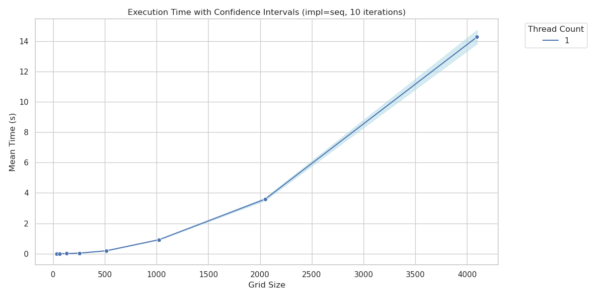
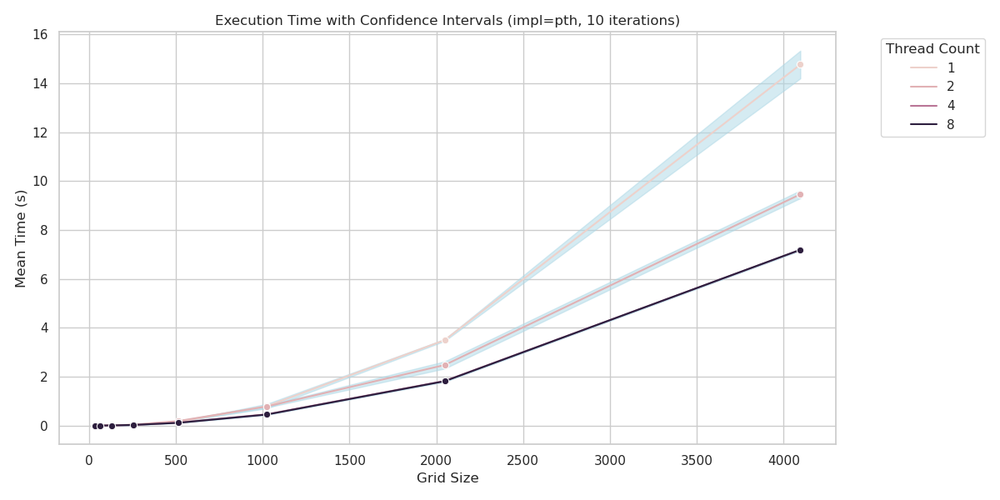
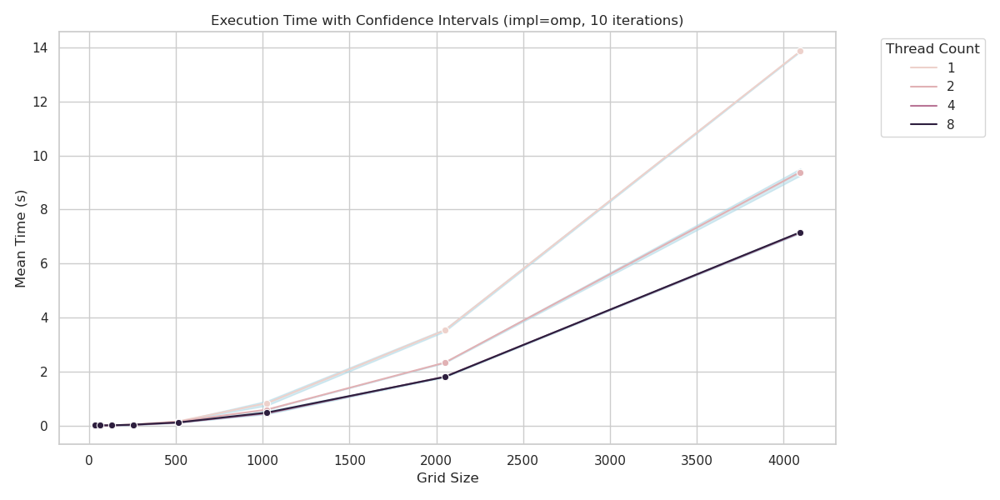

<!-- building: `pandoc relatorio.md -o relatorio.pdf` -->

# Introdução

Este texto contêm o relatório de execução dos exercícios propostos no EP1 da disciplina *Programação Concorrente e Paralela* (MAC0219) do Instituto de Matemática e Estatística da Universidade de São Paulo (IME-USP), no oferecimento de 2023.

Todos os experimentos foram realizados em uma máquina com um processador *11th Gen Intel i5-11320H*, e apresentam a média do tempo de execução de cada implementação variando o tamanho da grade do algoritmo e a quantidade de *threads* usadas, com uma barra que representa o intervalo de confiança com nível de 95%.

# Implementação sequencial

Os resultados dos experimentos podem ser observados no seguinte gráfico:

{ width=90% }

Estes resultados serão considerados *base*, isto é, que serão a comparação para as outras implementações. Como esperado, o tempo de execução cresce de forma quadrática conforme o tamanho da grade aumenta.

\newpage

# Implementação com *POSIX threads*

Os resultados dos experimentos podem ser observados no seguinte gráfico:

{ width=90% }

# Implementação com *OpenMP*

Os resultados dos experimentos podem ser observados no seguinte gráfico:

{ width=90% }

# Conclusão
